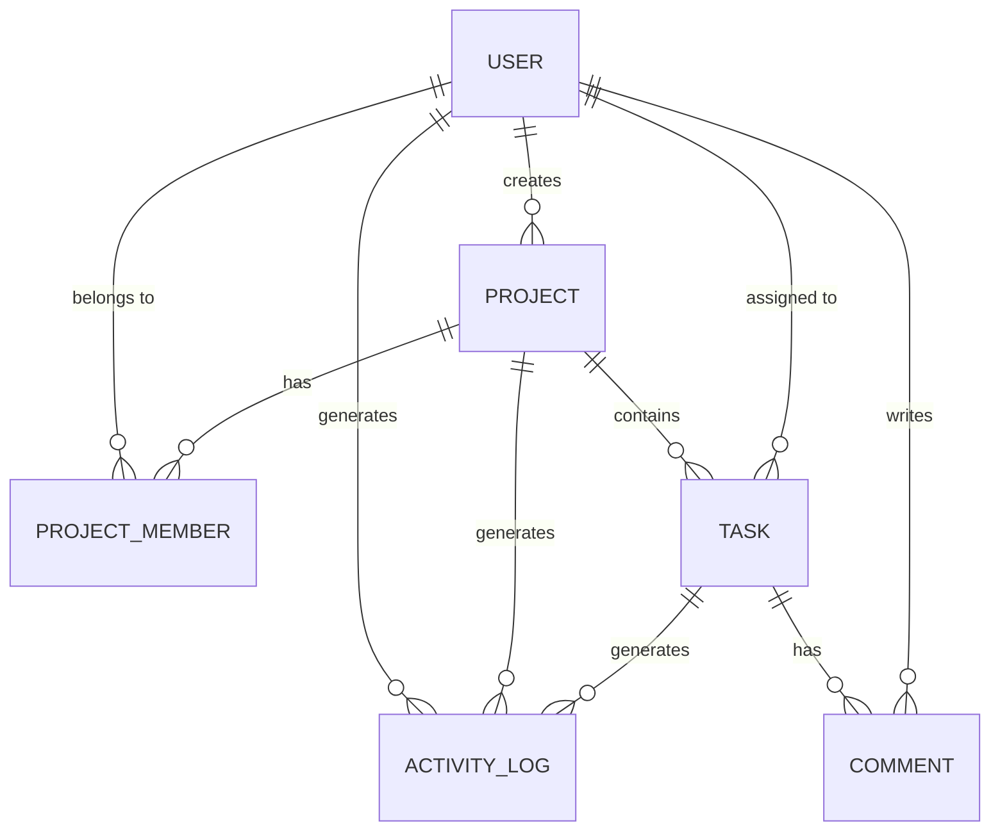

# Entity Relationship Diagram (ERD)

```mermaid
erDiagram
    USER ||--o{ PROJECT : "creates"
    USER ||--o{ PROJECT_MEMBER : "belongs to"
    PROJECT ||--o{ PROJECT_MEMBER : "has"
    PROJECT ||--o{ TASK : "contains"
    USER ||--o{ TASK : "assigned to"
    TASK ||--o{ COMMENT : "has"
    USER ||--o{ COMMENT : "writes"
    USER ||--o{ ACTIVITY_LOG : "generates"
    PROJECT ||--o{ ACTIVITY_LOG : "generates"
    TASK ||--o{ ACTIVITY_LOG : "generates"
```

*The diagram visualizes the main entities and their relationships used throughout the application.*
