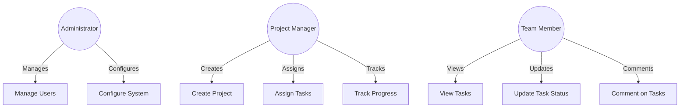
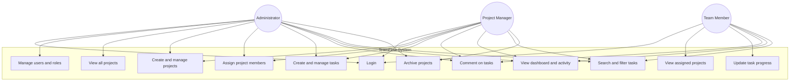

# TeamFlow – Use Case Diagram

*Illustrates the primary interactions of each role within the system.*

## Role summary

| Actor | Primary goals |
|-------|----------------|
| Administrator | Full system control: users, roles, all projects/tasks |
| Project Manager | Own projects, membership, task planning |
| Team Member | Execute assigned work and report progress |

## Role summary

| Actor | Primary goals |
|-------|----------------|
| Administrator | Full system control: users, roles, all projects/tasks |
| Project Manager | Own projects, membership, task planning |
| Team Member | Execute assigned work and report progress |
