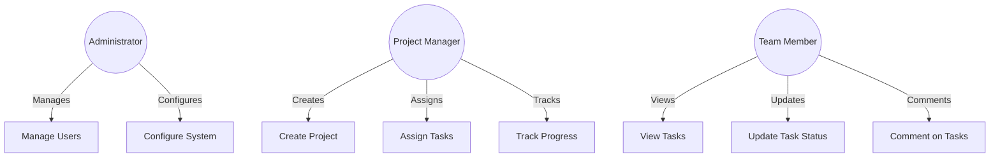

# Use Case Diagram

```mermaid
flowchart TB
  Admin((Administrator))
  PM((Project Manager))
  Member((Team Member))

  Admin -->|Manages| Users[Manage Users]
  Admin -->|Configures| System[Configure System]

  PM -->|Creates| Project[Create Project]
  PM -->|Assigns| Tasks[Assign Tasks]
  PM -->|Tracks| Progress[Track Progress]

  Member -->|Views| ViewTasks[View Tasks]
  Member -->|Updates| UpdateTask[Update Task Status]
  Member -->|Comments| Comment[Comment on Tasks]
```

*Illustrates the primary interactions of each role within the system.*

*Illustrates the primary interactions of each role within the system.*
